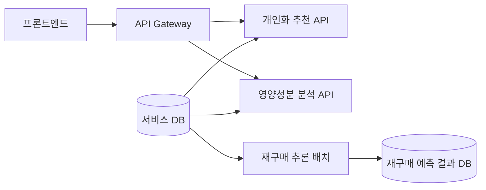

# 골라주개냥 AI

**반려동물의 구매 이력과 프로필, 상품·리뷰 데이터를 활용해 재구매 예측, 개인화 추천, 영양성분 분석을 제공하는 AI 팀 프로젝트입니다.**

골라주개냥은 반려동물 상품을 선택하고 구매하는 과정을 돕는 커머스 서비스입니다. 이 저장소는 세 기능의 데이터 처리, 모델 학습·평가, 추론 API와 배치, 서비스 연동 계약을 관리합니다.

## 🎯 해결하려는 문제

| 사용자 질문 | 기능 | 제공하는 정보 |
| --- | --- | --- |
| 구매한 상품을 언제 다시 구매할까? | 재구매 예측 | 마지막 구매 후 경과 시간을 반영한 향후 30일 이내 재구매 확률 |
| 내 반려동물에게 어떤 상품을 추천할까? | 개인화 추천 | 프로필·구매 이력·리뷰 기반 홈 추천 및 대체 상품 목록 |
| 이 상품의 성분을 어떻게 해석할까? | 영양성분 분석 | 영양 기준 비교, 알레르기 충돌 및 종·생애주기 판정 |

## 🧩 서비스 구조



추천과 영양 분석은 서비스 DB에서 필요한 정보를 조회해 동기식 HTTP 응답을 제공합니다. 재구매 예측은 별도 배치로 실행하고 결과를 저장합니다. 현재 재구매 시연 결과는 내부 검증용 `SHADOW` 상태로 관리합니다.

AI 팀의 구현 범위는 데이터 처리, 모델·규칙, 추론과 결과 저장, API 계약 및 테스트입니다. 클라우드 배포와 실행, Gateway 라우팅, 프론트엔드 화면 연결은 다른 서비스 파트와 협업하며, 코드 구현과 실제 배포 검증을 구분해 기록합니다.

## 🔍 핵심 구현과 설계

### 1. 재구매 예측 — 경과 시간을 반영한 조건부 확률

구매 이력의 마지막 주문은 관측 기간이 끝날 때까지 다음 구매가 확인되지 않을 수 있습니다. 이를 미구매 확정으로 처리하지 않고 **중도절단을 고려하는 XGBoost AFT**로 구매 간격을 모델링했습니다.

- 취소·반품과 주문 상태를 반영해 유효 구매 사건을 구성합니다.
- 마지막 구매 이후 `t`일이 지났다는 조건에서 향후 `h`일 내 재구매 확률을 `1 − S(t+h) / S(t)`로 계산합니다. `S`는 아직 재구매하지 않았을 확률입니다.
- 시간순으로 학습·검증·Test를 분리하고, LightGBM과 확률 오차·순위·보정 지표를 비교합니다.
- 모델과 피처 버전, 데이터 기준 시각, 실행 ID를 기록하고 동일 실행의 재시도에서 중복 적재를 방지합니다.

**시연에는 사전 고정한 AFT 모델을 사용했습니다.** 검증된 추론·적재 경로를 재사용하기 위한 결정이며, Test에서 품질 우위를 확정한 선택은 아닙니다.

관련 문서: [재구매 파트 개요·모델 평가](repurchase/README.md) / [학습·추론 및 실행](repurchase/data_analysis/README.md) / [모델 결정](repurchase/DEMO_MODEL_DECISION.md) / [추론 계약](repurchase/INFERENCE_CONTRACT.md) / [DB 계약](repurchase/database/README.md)

### 2. 개인화 추천 — 프로필, 리뷰 별점과 구매 이력의 결합

반려동물·상품 피처를 활용하는 **DeepFM 추천 파이프라인**에 리뷰 작성자 프로필 유사도와 구매 이력을 반영합니다. 홈 추천과 상품 상세의 대체 추천을 각각 제공합니다.

- 현재 리뷰 처리 경로는 사용자가 입력한 항목별 별점을 속성 점수로 변환합니다. 이전 KcELECTRA 감성 분석과 키워드 태깅 코드는 현재 추론 경로에서 사용하지 않습니다.
- 홈 추천은 알레르기 충돌 상품을 감점하고, 대체 추천은 충돌 상품을 제외하는 별도 정책을 사용합니다.
- 알레르기 정보 미응답과 명시적인 “없음”을 구분하고, 미확인 상태를 `PENDING`으로 전달합니다.
- Gateway 내부 인증과 반려동물 소유권을 확인해 다른 사용자의 프로필 조회를 제한합니다.

주요 API: `POST /recommend/home`, `POST /recommend/substitute`

관련 코드·문서: [추천 파이프라인](recommendation/endtoend/src/pipeline.py) / [API](recommendation/endtoend/src/api/main.py) / [인증·소유권 계약](recommendation/endtoend/docs/gateway_ownership_contract.md) / [알레르기 처리와 검증](recommendation/endtoend/docs/integration_followup_20261005.md)

### 3. 영양성분 분석 — 근거를 정규화하는 규칙 엔진

상품의 보증성분과 원재료를 **Canonical Input**으로 정규화하고, NIAS reference 비교와 안전성 규칙을 적용합니다. 동일한 입력·규칙 버전·reference 버전에서 동일한 결과를 반환하는 결정론적 구조입니다.

- 영양 기준 비교와 알레르기·종·생애주기 판정을 별도로 계산합니다.
- 비교 가능한 성분만 분석하고, 누락되거나 해석할 수 없는 근거는 `UNKNOWN` 또는 데이터 부족 상태로 남깁니다.
- 알레르기 정보의 상태와 목록이 모순되면 안전하다고 간주하지 않습니다.
- 스키마 기반 합성 입력에는 `SCHEMA_DRIVEN_SYNTHETIC`, `production_evidence=false`를 표시해 실제 상품 근거와 구분합니다.

주요 API: `POST /api/nutrition/analyze/by-service-id`, `POST /api/nutrition/compare`

관련 문서: [기능·API·실행](nutrition/README.md) / [입력 계약](nutrition/docs/canonical_input_contract.md) / [서비스 통합 구조](nutrition/docs/service_integration_architecture.md)

## ✅ 서비스 검증

아래는 저장소에 기록된 평가·검증 결과입니다. 모델 품질 평가, 로컬 계약 검증, 클라우드 적재 확인은 서로 다른 검증 범위입니다.

| 대상 | 기록된 검증 | 범위와 한계 |
| --- | --- | --- |
| 재구매 배치 | dev SHADOW 50,517건 적재, 동일 실행 ID 재시도에서 추가 적재 없음 | 추론·저장·멱등성 확인. 실제 사용자 품질 검증과 별도 |
| 추천 인증·프로필 처리 | 2026-10-06 기록 기준 회귀 90개 통과, 소유권 PostgreSQL 조회 6개 통과 | 합성 DB와 모델 대역 사용. 실제 학습 모델 품질·Gateway E2E는 범위 밖 |
| 영양 분석 Mock 보완 | 2026-10-06 기록 기준 테스트 632개, 로컬 HTTP 13요청·58개 assertion 통과 | 보관 스냅샷과 합성 입력 사용. 실제 DB·Gateway·Pod 검증과 별도 |

근거: [SHADOW 배치 검증](repurchase/data_analysis/SHADOW_VALIDATION_HANDOFF.md) / [추천 회귀 기록](recommendation/endtoend/docs/gateway_ownership_contract.md) / [영양 분석 검증 기록](nutrition/docs/service_evidence_gap_resolution_20261006.md)

## 🛠️ 기술 스택

| 파트 | 주요 기술 | 활용 |
| --- | --- | --- |
| 재구매 예측 | XGBoost AFT, LightGBM, pandas, NumPy | 구매 사건 처리, 조건부 확률 추론, 모델 비교·평가 |
| 개인화 추천 | PyTorch, DeepFM, FastAPI | 프로필·리뷰 별점 기반 추천, 홈·대체 추천 API |
| 영양성분 분석 | Python 규칙 엔진, FastAPI | 입력 정규화, 영양 기준 비교, 알레르기·종·생애주기 판정 |

**공통 환경과 서비스 연동**

| 영역 | 기술 |
| --- | --- |
| 개발 환경 | Python 3.11 |
| 서비스 데이터·결과 저장 | PostgreSQL |
| 테스트·품질 검사 | pytest, Ruff(재구매) |
| CI·빌드·배포 연동 | GitHub Actions, Docker, Jenkins |
| 추천 모델 아티팩트 관리 | Amazon S3 |

## 📁 저장소 구조

```text
.
├── repurchase/
│   ├── data_analysis/        # 데이터 분석, 모델 학습·평가, 추론 배치
│   └── database/             # 예측 결과 스키마와 조회 계약
├── recommendation/
│   ├── endtoend/             # 추천 학습, 추론 API, 리뷰 별점 처리
│   └── poc/                  # 더미 데이터 기반 초기 파이프라인
├── nutrition/
│   ├── scripts/              # 규칙 엔진, 입력 어댑터, API
│   ├── tests/                # 도메인·API·계약 회귀 테스트
│   └── docs/                 # 입력·DB·서비스 계약과 검증 기록
├── .github/                  # CI, 이슈 양식 및 협업 가이드
└── Jenkinsfile               # 서비스 빌드·배포 파이프라인
```

## 🚀 로컬 실행

파트마다 별도 가상환경을 사용합니다. Python 3.11 계열을 기준으로 하며 재구매 파트는 3.11.15로 고정합니다. 원본 데이터, DB 자격 증명, 모델 아티팩트는 실행 환경에서 별도로 준비합니다.

<details>
<summary>영양성분 분석 API</summary>

```bash
cd nutrition
python -m venv .venv
source .venv/bin/activate
python -m pip install -r requirements.lock
python -m uvicorn scripts.api_nutrition:app --reload --port 8002
```

서비스 ID 조회에는 DB 연결과 Gateway 인증 설정이 필요합니다. 요청에 직접 입력을 전달하는 로컬 분석 경로와 설정 항목은 [파트 README](nutrition/README.md)를 참고합니다.

</details>

<details>
<summary>개인화 추천 API</summary>

```bash
cd recommendation/endtoend
python -m venv .venv
source .venv/bin/activate
python -m pip install -r requirements-api.txt
python -m uvicorn src.api.main:app --reload --port 8000
```

DeepFM 모델 아티팩트, 데이터 소스와 Gateway 인증 설정이 필요합니다. 학습 환경은 [requirements.txt](recommendation/endtoend/requirements.txt)에서 별도로 관리합니다. 설정은 [API 코드](recommendation/endtoend/src/api/main.py)와 [인증 계약](recommendation/endtoend/docs/gateway_ownership_contract.md)을 참고합니다.

</details>

<details>
<summary>재구매 분석·학습·배치</summary>

[실행 문서](repurchase/data_analysis/README.md)에 데이터 준비, 학습·평가, 배치 명령과 테스트 방법을 정리했습니다. DB 쓰기 허용 조건과 결과 상태는 [클라우드 데이터 계약](repurchase/CLOUD_DATA_CONTRACT.md)을 따릅니다.

</details>

## 🤝 협업과 남은 과제

[이슈·PR 가이드](.github/ISSUE_GUIDELINES.md)에 따라 변경을 관리하고, [재구매 CI](.github/workflows/repurchase-ci.yml)와 [영양 분석 CI](.github/workflows/nutrition-ci.yml)로 파트별 검증을 수행합니다.

실제 사용자 데이터에서의 추천·재구매 품질 평가, 새 이미지 기준 Gateway·프론트엔드 E2E 확인, 재구매 운영 노출 정책 확정은 후속 과제입니다. 영양 분석의 Mock 결과는 실제 상품의 영양학적 완전성이나 임상적 적합성을 보장하지 않습니다.
