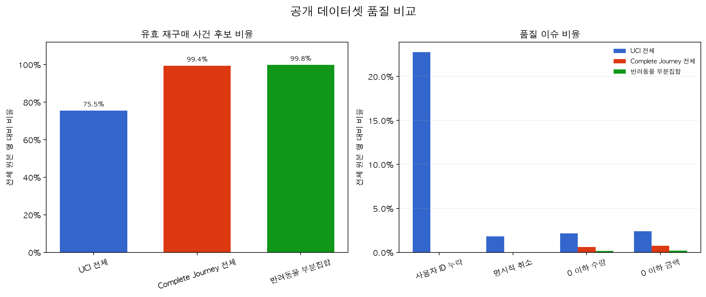
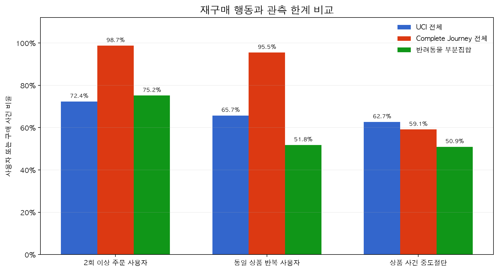
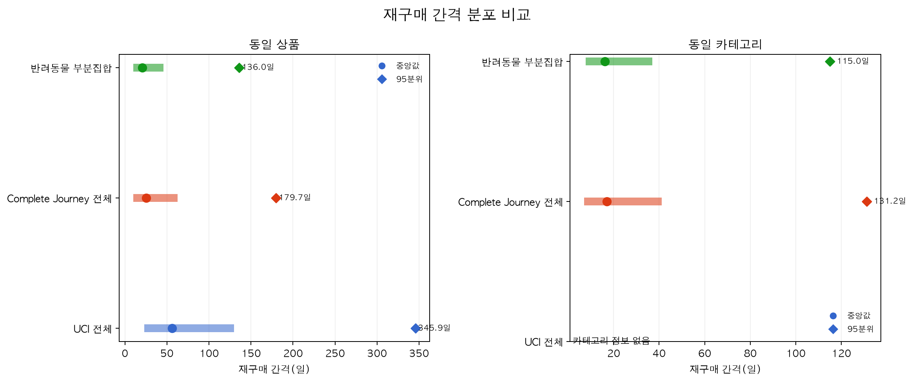
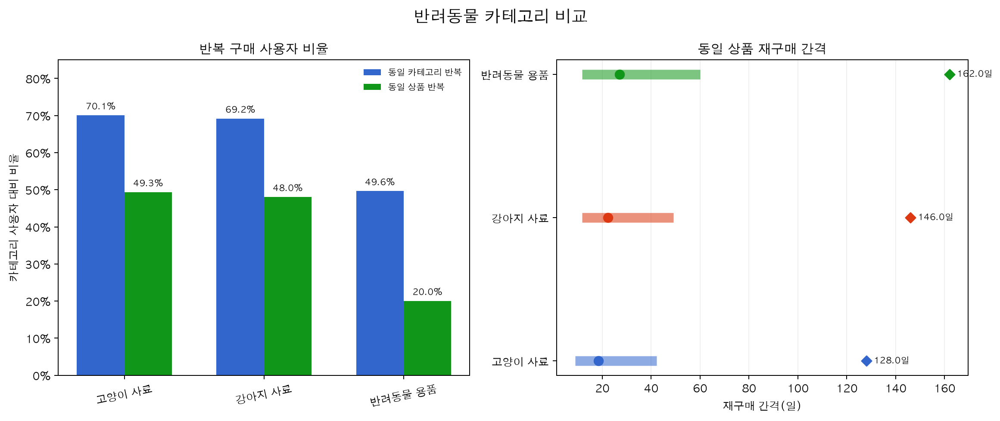
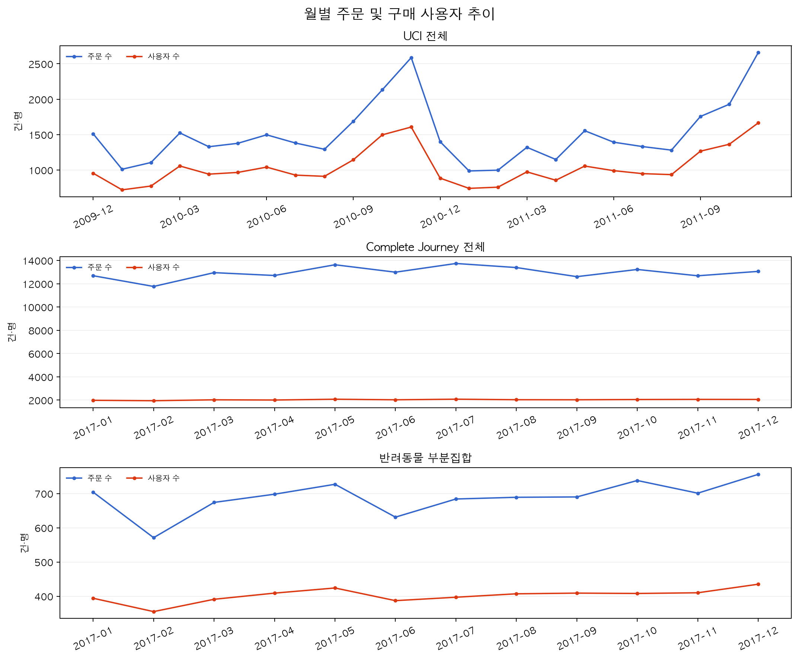

# 재구매 데이터 시각화

## 데이터 품질

UCI 데이터는 사용자 ID 누락과 취소 거래를 포함해 유효 구매 후보 비율이 다른 데이터보다 낮다. 목데이터는 이 비율을 그대로 복제하지 않고, 자체 회원 서비스의 필수 식별자 정책과 취소·반품 검증 시나리오를 분리해 적용한다.

## 재구매 행동과 중도절단

반복 주문 사용자 비율만으로 학습 가능성을 판단하면 안 된다. 동일 상품 반복 사용자 비율과 마지막 구매의 중도절단 비율을 함께 확인해야 재구매 라벨과 관측 종료 정책을 설계할 수 있다.

## 재구매 간격

상품 단위 재구매 간격은 카테고리 단위보다 길고 95분위까지 오른쪽 꼬리가 이어진다. 따라서 하나의 평균값이나 대칭 정규분포로 목데이터 주기를 생성하지 않는다.

## 반려동물 카테고리

고양이·강아지 사료는 반려동물 용품보다 동일 상품 반복률이 높고 재구매 간격도 상대적으로 짧다. 목데이터는 카테고리마다 반복률과 주기 분포를 따로 설정한다.

## 월별 추이

월별 사용자 수와 주문 수를 함께 확인해 특정 월에 주문만 비정상적으로 증가하는 목데이터를 방지한다. 시간 분할 전후에도 각 구간의 활동량과 사용자 구성이 지나치게 달라지지 않는지 점검한다.
