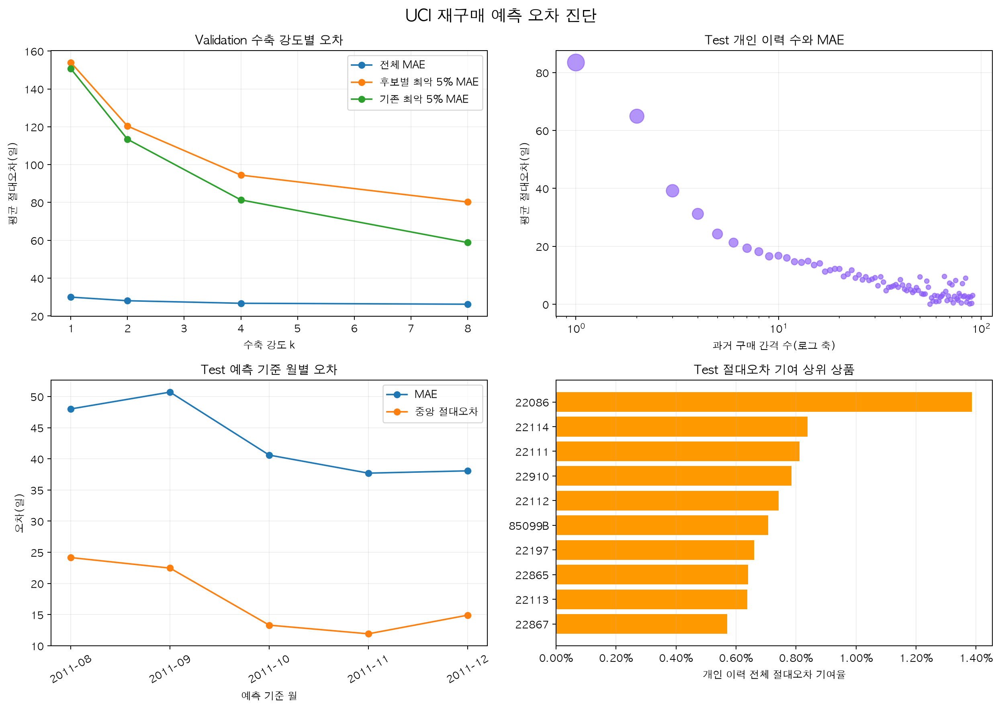

# 재구매 데이터 시각화

## 데이터 품질

UCI 데이터는 사용자 ID 누락과 취소 거래를 포함해 유효 구매 후보 비율이 다른 데이터보다 낮다. 목데이터는 이 비율을 그대로 복제하지 않고, 자체 회원 서비스의 필수 식별자 정책과 취소·반품 검증 시나리오를 분리해 적용한다.

## 재구매 행동과 중도절단

반복 주문 사용자 비율만으로 학습 가능성을 판단하면 안 된다. 동일 상품 반복 사용자 비율과 마지막 구매의 중도절단 비율을 함께 확인해야 재구매 라벨과 관측 종료 정책을 설계할 수 있다.

## 재구매 간격

상품 단위 재구매 간격은 카테고리 단위보다 길고 95분위까지 오른쪽 꼬리가 이어진다. 따라서 하나의 평균값이나 대칭 정규분포로 목데이터 주기를 생성하지 않는다.

## 반려동물 카테고리

고양이·강아지 사료는 반려동물 용품보다 동일 상품 반복률이 높고 재구매 간격도 상대적으로 짧다. 목데이터는 카테고리마다 반복률과 주기 분포를 따로 설정한다.

## 월별 추이

월별 사용자 수와 주문 수를 함께 확인해 특정 월에 주문만 비정상적으로 증가하는 목데이터를 방지한다. 시간 분할 전후에도 각 구간의 활동량과 사용자 구성이 지나치게 달라지지 않는지 점검한다.

## 재구매 예측 오차 진단

개인 구매 간격이 1~2건인 구간에서 MAE가 가장 크고, 이력이 쌓일수록 오차가 감소한다. 수축 강도를 높이면 전체 MAE와 큰 꼬리오차는 줄지만 중앙 절대오차와 ±7일 적중률은 악화되므로 하나의 지표만으로 강도를 선택하지 않는다.

월별 MAE는 9월에 가장 높고 이후 감소해 시간에 따른 데이터 분포 변화도 확인해야 한다. 오차 기여 상위 10개 상품의 합계는 개인 이력 전체 절대오차의 7.78%이므로, 일부 상품을 제거하는 것만으로 전체 문제를 해결하기 어렵다.

다음 실험은 수축 중앙값을 안정화된 비교 기준으로 남기고, 개인 이력 수·간격 변동성·상품·시기 피처의 비선형 상호작용을 학습할 수 있는 LightGBM을 우선 비교한다. 생존분석은 아직 다음 구매가 관측되지 않은 중도절단 표본까지 사용하는 별도 실험으로 분리한다.
